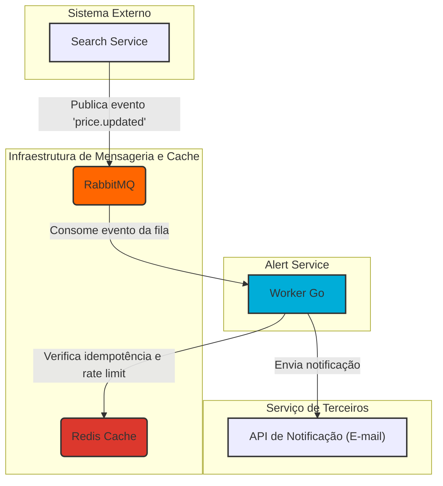

# Alert Service

O Alert Service é um microsserviço consumidor responsável por processar eventos de alteração de preço de voos e notificar os usuários finais.

## Visão Geral

⚠️ **Projeto em Desenvolvimento** ⚠️

Este serviço segue os princípios da Arquitetura Limpa (Clean Architecture) e Hexagonal (Ports & Adapters) para isolar a lógica de negócio de dependências externas como mensageria e APIs. O serviço:

- Consome eventos de alteração de preço de uma fila no RabbitMQ.
- Garante o processamento único de cada evento utilizando Redis.
- Aplica regras de negócio, como limites de envio (Rate Limiting), para evitar spam.
- Orquestra o envio de notificações de alerta para os usuários via um serviço de e-mail externo.

---

## Fluxo planejado (pode sofrer alterações)



---

## Estrutura de Diretórios

```
alert-service/
├─ cmd/
│  └─ worker/
│     └─ main.go
├─ internal/
│  ├─ domain/
│  │  └─ alert.go
│  ├─ errors/
│  │  └─ api_error.go
│  ├─ infra/
│  │  ├─ cache/
│  │  │  └─ connection.go
│  │  ├─ database/
│  │  │  ├─ connection.go
│  │  │  ├─ mapper.go
│  │  │  └─ repository.go
│  │  └─ smtp/
│  │     └─ sender.go
│  ├─ transport/
│  │  ├─ http/
│  │  │  ├─ handler.go
│  │  │  ├─ routes.go
│  │  │  └─ server.go
│  │  └─ rabbitmq/
│  │     └─ consumer.go
│  └─ usecases/
│     └─ process_alert.go
├─ .env
├─ .gitignore
├─ docker-compose.dev.yml
├─ docker-compose.yml
├─ Dockerfile
├─ go.mod
├─ go.sum
└─ README.md
```

## Tecnologias Planejadas

- **Go** - Linguagem principal
- **Gin** - Framework HTTP
- **RabbitMQ** - Mensageria
- **Redis** - Cache e idempotência
- **PostgreSQL** - Banco de dados
- **Docker** - Containerização

## Como Executar

### Desenvolvimento Local

1. **Subir dependências:**
   ```bash
   docker-compose -f docker-compose.dev.yml up -d
   ```

2. **Executar aplicação:**
   ```bash
   go run cmd/worker/main.go
   ```

### Build
```bash
go build -o bin/worker cmd/worker/main.go
```

### Docker
```bash
docker build -t alert-service .
docker run alert-service
```